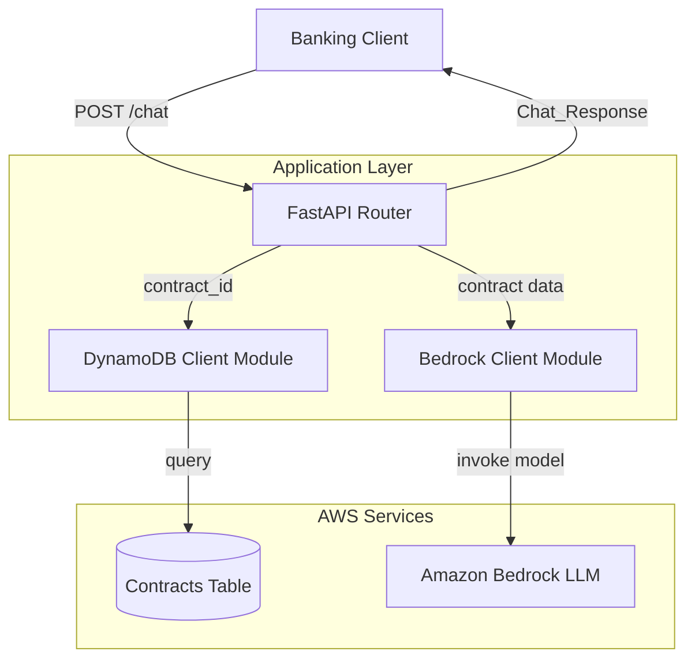
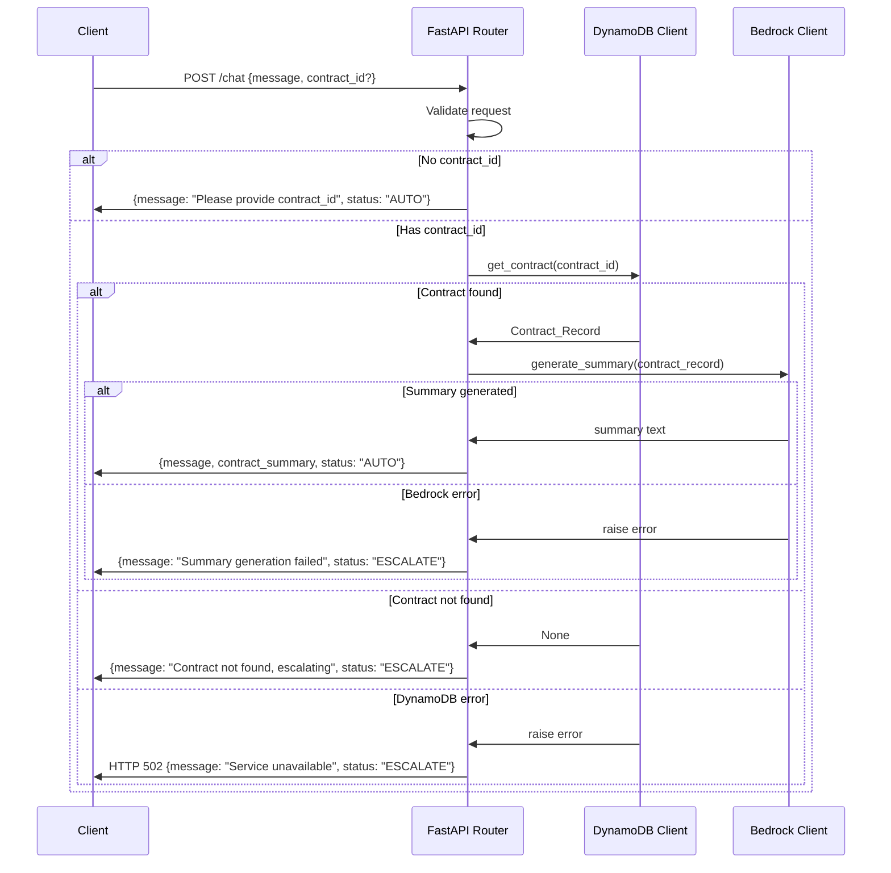

# Design Document: AI Banking Assistant

## Overview

The AI Banking Assistant is a chat-based API service built with Python and FastAPI that provides banking customers with AI-generated summaries of their contracts. The system retrieves contract data from AWS DynamoDB and uses Amazon Bedrock LLM to generate human-readable summaries. When contracts cannot be found or errors occur, the system escalates to human support.

### Key Design Decisions

- **FastAPI** for the HTTP layer: provides automatic request validation via Pydantic, async support, and OpenAPI documentation out of the box.
- **boto3** for AWS service interaction: standard Python SDK for DynamoDB and Bedrock.
- **Modular architecture**: separate modules for routing, data access, and LLM invocation to enable independent testing and clear separation of concerns.
- **Structured logging**: Python's built-in `logging` module with JSON-structured output for observability.

## Architecture



### Request Flow



## Components and Interfaces

### Module: `main.py` (FastAPI Router)

Handles HTTP endpoint routing, request validation, orchestration of the DynamoDB and Bedrock clients, and response construction.

```python
# POST /chat endpoint
async def chat(request: ChatRequest) -> ChatResponse:
    """
    Orchestrates the chat flow:
    1. Validate and log incoming request
    2. If no contract_id, return prompt
    3. Retrieve contract from DynamoDB
    4. Generate summary via Bedrock
    5. Return structured response
    """
    ...
```

### Module: `dynamodb_client.py` (DynamoDB Client)

Encapsulates all DynamoDB access logic. Provides a single function to retrieve a contract by ID.

```python
class DynamoDBClient:
    def __init__(self, table_name: str = "Contracts"):
        """Initialize boto3 DynamoDB resource."""
        ...

    def get_contract(self, contract_id: str) -> Optional[ContractRecord]:
        """
        Retrieve a contract from DynamoDB by contract_id.
        
        Args:
            contract_id: The primary key to query
            
        Returns:
            ContractRecord if found, None if not found
            
        Raises:
            DynamoDBError: On connection errors, timeouts, or invalid contract_id
        """
        ...
```

### Module: `bedrock_client.py` (Bedrock Client)

Encapsulates all Amazon Bedrock LLM invocation logic. Provides a function to generate a contract summary.

```python
class BedrockClient:
    def __init__(self, model_id: str = "anthropic.claude-3-haiku-20240307-v1:0", timeout: int = 30):
        """Initialize boto3 Bedrock runtime client."""
        ...

    def generate_summary(self, contract_record: ContractRecord) -> str:
        """
        Generate a summary of a contract using Bedrock LLM.
        
        Args:
            contract_record: The contract data to summarize
            
        Returns:
            Summary text, truncated to 1024 characters
            
        Raises:
            BedrockError: On API errors or timeout
        """
        ...
```

### Module: `models.py` (Pydantic Models)

Defines request/response schemas and domain data models.

```python
class ChatRequest(BaseModel):
    message: str  # max_length=1000, required
    contract_id: Optional[str] = None

class ContractRecord(BaseModel):
    contract_id: str
    amount: float
    interest_rate: float
    duration: str

class ChatResponse(BaseModel):
    message: str
    contract_summary: Optional[str] = None
    status: str  # "AUTO" or "ESCALATE"
```

### Module: `exceptions.py` (Custom Exceptions)

```python
class DynamoDBError(Exception):
    """Raised when DynamoDB operations fail."""
    def __init__(self, message: str, contract_id: str): ...

class BedrockError(Exception):
    """Raised when Bedrock invocation fails."""
    def __init__(self, message: str): ...
```

## Data Models

### Contracts DynamoDB Table Schema

| Field         | Type   | Description                        |
|---------------|--------|------------------------------------|
| contract_id   | String | Primary key (partition key)        |
| amount        | Number | Contract monetary amount           |
| interest_rate | Number | Annual interest rate (decimal)     |
| duration      | String | Contract duration (e.g., "5 years")|

### ChatRequest Schema

| Field       | Type            | Constraints              | Required |
|-------------|-----------------|--------------------------|----------|
| message     | string          | max 1000 characters      | Yes      |
| contract_id | string \| null  | non-empty when provided  | No       |

### ChatResponse Schema

| Field            | Type           | Description                              |
|------------------|----------------|------------------------------------------|
| message          | string         | Human-readable response message          |
| contract_summary | string \| null | Bedrock-generated summary or null        |
| status           | string         | "AUTO" or "ESCALATE"                     |

### Status Values

| Status     | Meaning                                           |
|------------|---------------------------------------------------|
| AUTO       | Request processed successfully without escalation |
| ESCALATE   | Request requires human support intervention       |


## Correctness Properties

*A property is a characteristic or behavior that should hold true across all valid executions of a system—essentially, a formal statement about what the system should do. Properties serve as the bridge between human-readable specifications and machine-verifiable correctness guarantees.*

### Property 1: Invalid requests are rejected with 422

*For any* request body that is either missing the `message` field or contains a `message` exceeding 1000 characters, the Chat_API SHALL return an HTTP 422 response with a validation error.

**Validates: Requirements 1.4, 1.5**

### Property 2: Valid contract_id requests return HTTP 200

*For any* valid request containing a non-empty `message` (≤ 1000 characters) and a non-empty `contract_id`, when downstream services succeed, the Chat_API SHALL return an HTTP 200 response with a valid Chat_Response.

**Validates: Requirements 1.3**

### Property 3: DynamoDB response mapping preserves contract data

*For any* contract data returned by DynamoDB (containing contract_id, amount, interest_rate, and duration), the DynamoDB_Client SHALL return a ContractRecord with field values identical to those in the DynamoDB response.

**Validates: Requirements 2.2**

### Property 4: DynamoDB errors contain contract_id and failure reason

*For any* DynamoDB connection error or timeout, the raised DynamoDBError SHALL contain both the contract_id that was queried and a description of the failure reason.

**Validates: Requirements 2.4**

### Property 5: Bedrock prompt construction includes all contract fields

*For any* valid ContractRecord, the prompt sent to Bedrock SHALL contain the text "Summarize the following contract details in 3 bullet points:" followed by the contract_id, amount, interest_rate, and duration values from the record.

**Validates: Requirements 4.1**

### Property 6: Bedrock errors propagate with failure reason

*For any* error returned by Amazon Bedrock (including timeouts), the BedrockClient SHALL raise a BedrockError containing a descriptive failure reason.

**Validates: Requirements 4.3**

### Property 7: Summary truncation to maximum 1024 characters

*For any* summary text returned by Amazon Bedrock, the BedrockClient SHALL return a string of at most 1024 characters, where the content up to the truncation point matches the original text.

**Validates: Requirements 4.5**

### Property 8: Response structure invariant

*For any* request processed by the Chat_API (regardless of success or failure path), the JSON response SHALL contain exactly three fields: `message` (string), `contract_summary` (string or null), and `status` (string with value "AUTO" or "ESCALATE").

**Validates: Requirements 5.1**

### Property 9: Summary passthrough from Bedrock to response

*For any* successfully generated summary from the Bedrock_Client, the Chat_API response SHALL contain that exact summary text (after truncation) in the `contract_summary` field without modification.

**Validates: Requirements 4.2, 5.3**

### Property 10: Success message contains contract_id

*For any* successfully summarized contract, the Chat_API response `message` field SHALL contain the contract_id that was queried.

**Validates: Requirements 5.4**

## Error Handling

### Error Categories and Responses

| Error Condition | HTTP Status | Response Status | Message | Logging Level |
|----------------|-------------|-----------------|---------|---------------|
| Missing/invalid `message` field | 422 | N/A (validation error) | Field validation details | WARNING |
| Message exceeds 1000 chars | 422 | N/A (validation error) | Length exceeded details | WARNING |
| No `contract_id` provided | 200 | AUTO | Prompt for contract_id | INFO |
| Contract not found in DynamoDB | 200 | ESCALATE | "Contract not found, escalating to support" | INFO |
| DynamoDB connection error/timeout | 502 | ESCALATE | "Service temporarily unavailable" | WARNING |
| Empty/None `contract_id` passed to DynamoDB client | N/A (internal) | N/A | Raises DynamoDBError | ERROR |
| Bedrock error or timeout (>30s) | 200 | ESCALATE | "Summary generation failed" | ERROR |
| Unexpected internal error | 500 | ESCALATE | "Internal error" | ERROR |

### Exception Hierarchy

```python
class DynamoDBError(Exception):
    """Raised when DynamoDB operations fail."""
    contract_id: str
    reason: str

class BedrockError(Exception):
    """Raised when Bedrock invocation fails."""
    reason: str
```

### Error Handling Strategy

1. **Validation errors**: Handled automatically by FastAPI/Pydantic. Returns 422 with structured error details.
2. **Business logic errors** (contract not found): Return 200 with ESCALATE status — this is expected behavior, not a system failure.
3. **Infrastructure errors** (DynamoDB connection failures): Return 502 with ESCALATE status — indicates a transient system issue.
4. **LLM errors** (Bedrock failures): Return 200 with ESCALATE status — the contract was found but summary generation failed.
5. **Unexpected errors**: Global exception handler catches all unhandled exceptions, logs full stack trace, returns 500.

### Timeout Configuration

| Service | Timeout | Behavior on Timeout |
|---------|---------|---------------------|
| DynamoDB | 5 seconds | Raise DynamoDBError with timeout reason |
| Bedrock | 30 seconds | Raise BedrockError with timeout reason |

## Testing Strategy

### Unit Tests (Example-Based)

Unit tests target specific scenarios and edge cases:

- **Chat endpoint**: No contract_id returns prompt (1.2), contract not found returns escalation (3.1–3.3), DynamoDB error returns 502 (3.4), Bedrock error returns escalation (5.5)
- **DynamoDB client**: No matching record returns None (2.3), empty/None contract_id raises error (2.5)
- **Bedrock client**: Model ID is Claude or Titan (4.4)
- **Logging**: Verify all log levels and content (7.1–7.7)
- **Module independence**: Import tests for separation of concerns (6.1–6.4)

### Property-Based Tests

Property-based tests verify universal correctness properties using **Hypothesis** (Python PBT library).

**Configuration:**
- Minimum 100 iterations per property
- Each test tagged with: `Feature: ai-banking-assistant, Property {N}: {title}`

**Properties to implement:**

| Property | Module Under Test | Generator Strategy |
|----------|------------------|--------------------|
| 1: Invalid requests rejected | FastAPI app (TestClient) | Random payloads: missing message, oversized strings |
| 2: Valid requests return 200 | FastAPI app (TestClient) | Random valid messages + contract_ids, mocked services |
| 3: DynamoDB mapping preserves data | DynamoDBClient | Random contract fields (strings, floats) |
| 4: DynamoDB errors contain info | DynamoDBClient | Random contract_ids + error messages |
| 5: Prompt construction | BedrockClient | Random ContractRecords |
| 6: Bedrock errors propagate | BedrockClient | Random error messages/types |
| 7: Summary truncation | BedrockClient | Random strings of length 0–5000 |
| 8: Response structure | FastAPI app (TestClient) | All request variants (valid, invalid, edge cases) |
| 9: Summary passthrough | FastAPI app (TestClient) | Random summary strings via mocked Bedrock |
| 10: Message contains contract_id | FastAPI app (TestClient) | Random contract_ids via mocked success flow |

### Integration Tests

Integration tests verify end-to-end behavior with real AWS services (run in CI with test accounts):

- DynamoDB query within 5 seconds (2.1)
- Full request flow with real DynamoDB and Bedrock
- Timeout behavior under load

### Test Dependencies

```
pytest
hypothesis
httpx  # for FastAPI TestClient async support
moto   # for DynamoDB mocking
```
