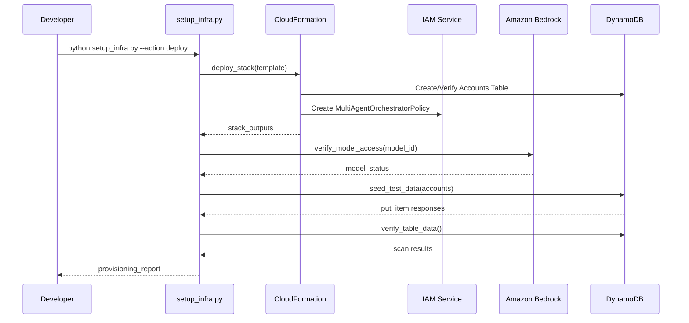

# Design Document: Infrastructure Provisioning

## Overview

Infrastructure provisioning for the Multi-Agent Orchestrator feature of the AI Banking Assistant. Covers IAM policy deployment, Bedrock model access verification, CloudFormation template for reproducible infrastructure, and a Python setup script for local development. The DynamoDB Accounts table already exists in us-east-1 (account 861976376325) with seed data.

## Architecture

The infrastructure provisioning system follows a layered architecture:

1. **CLI Layer** — `argparse`-based entrypoint in `setup_infra.py` that routes commands to the appropriate workflow.
2. **Orchestration Layer** — `run_provisioning()` coordinates the ordered execution of provisioning steps.
3. **Service Layer** — Individual functions (`deploy_cloudformation_stack`, `create_iam_policy`, `verify_bedrock_model_access`, `seed_test_data`, `verify_all_resources`) each handle one resource type.
4. **AWS SDK Layer** — `boto3` clients for CloudFormation, DynamoDB, Bedrock, and IAM.



## Components and Interfaces

### Core Interfaces/Types

```python
from dataclasses import dataclass
from enum import Enum
from typing import Optional


class ProvisioningStatus(Enum):
    """Status of a provisioning step."""
    PENDING = "pending"
    IN_PROGRESS = "in_progress"
    COMPLETED = "completed"
    FAILED = "failed"
    SKIPPED = "skipped"


@dataclass
class ProvisioningResult:
    """Result of a single provisioning step."""
    step_name: str
    status: ProvisioningStatus
    message: str
    resource_arn: Optional[str] = None


@dataclass
class InfraConfig:
    """Configuration for infrastructure provisioning."""
    region: str = "us-east-1"
    account_id: str = "861976376325"
    table_name: str = "Accounts"
    stack_name: str = "MultiAgentOrchestratorInfra"
    bedrock_model_id: str = "anthropic.claude-haiku-4-5-20251001-v1:0"
    policy_name: str = "MultiAgentOrchestratorPolicy"


@dataclass
class AccountSeedData:
    """Seed data for a single account record."""
    account_id: str
    balance: float
    currency: str
    account_type: str
```

### Key Functions

#### deploy_cloudformation_stack()

```python
def deploy_cloudformation_stack(
    config: InfraConfig,
    template_path: str,
    wait: bool = True,
) -> ProvisioningResult:
    """Deploy or update the CloudFormation stack."""
    ...
```

**Preconditions:**
- `config.region` is a valid AWS region string
- `config.stack_name` is non-empty and <= 128 characters
- `template_path` points to a valid YAML CloudFormation template file
- AWS credentials are configured with `cloudformation:CreateStack`, `cloudformation:UpdateStack`, `cloudformation:DescribeStacks` permissions

**Postconditions:**
- If stack does not exist: creates stack, returns `COMPLETED` with stack ARN
- If stack exists and template differs: updates stack, returns `COMPLETED`
- If stack exists and no changes: returns `SKIPPED` with existing ARN
- If deployment fails: returns `FAILED` with error message
- Stack reaches `CREATE_COMPLETE` or `UPDATE_COMPLETE` state before returning (when `wait=True`)

#### verify_bedrock_model_access()

```python
def verify_bedrock_model_access(config: InfraConfig) -> ProvisioningResult:
    """Verify that the Bedrock model is accessible in the target region."""
    ...
```

**Preconditions:**
- `config.bedrock_model_id` is a valid Bedrock foundation model identifier
- `config.region` is a valid AWS region where Bedrock is available
- AWS credentials are configured with `bedrock:GetFoundationModel` permission

**Postconditions:**
- If model access is granted: returns `COMPLETED` with model ARN
- If model access is not enabled: returns `FAILED` with instructions to enable access
- If model ID is invalid: returns `FAILED` with descriptive error
- Does not modify any resources (read-only operation)

#### create_iam_policy()

```python
def create_iam_policy(
    config: InfraConfig,
    attach_to_role: Optional[str] = None,
) -> ProvisioningResult:
    """Create the IAM managed policy for DynamoDB + Bedrock access."""
    ...
```

**Preconditions:**
- `config.account_id` is a valid 12-digit AWS account ID
- `config.policy_name` is non-empty and <= 128 characters
- AWS credentials have `iam:CreatePolicy` permission (and `iam:AttachRolePolicy` if `attach_to_role` is provided)

**Postconditions:**
- If policy does not exist: creates policy with DynamoDB GetItem + Bedrock InvokeModel statements, returns `COMPLETED` with policy ARN
- If policy already exists: returns `SKIPPED` with existing policy ARN
- If `attach_to_role` is provided and valid: attaches policy to the specified role
- Policy document contains exactly 2 statements: `AccountsTableReadAccess` and `BedrockIntentClassification`

#### seed_test_data()

```python
def seed_test_data(
    config: InfraConfig,
    accounts: list[AccountSeedData],
    overwrite: bool = False,
) -> ProvisioningResult:
    """Seed the Accounts table with test data."""
    ...
```

**Preconditions:**
- `config.table_name` refers to an existing, ACTIVE DynamoDB table
- `accounts` is a non-empty list of `AccountSeedData` objects
- Each `AccountSeedData.account_id` is non-empty
- Each `AccountSeedData.balance` is >= 0
- AWS credentials have `dynamodb:PutItem` and `dynamodb:GetItem` permissions

**Postconditions:**
- All accounts in `accounts` list exist in the table after execution
- If `overwrite=False` and item exists: skips that item (no overwrite)
- If `overwrite=True`: overwrites existing items
- Returns `COMPLETED` with count of items written
- Returns `FAILED` if any write operation raises an exception

#### verify_all_resources()

```python
def verify_all_resources(config: InfraConfig) -> list[ProvisioningResult]:
    """Run verification checks on all provisioned resources."""
    ...
```

**Preconditions:**
- `config` contains valid values for all fields
- AWS credentials have read permissions for DynamoDB, Bedrock, and IAM

**Postconditions:**
- Returns a list of `ProvisioningResult` for each verification check
- Checks performed: table status, item count, Bedrock model access, IAM policy existence
- Each result is independent (one failure does not prevent other checks)
- No resources are modified (read-only operation)

#### run_provisioning()

```python
def run_provisioning(
    config: InfraConfig,
    skip_existing: bool = True,
) -> list[ProvisioningResult]:
    """Orchestrate the full provisioning workflow."""
    ...
```

**Preconditions:**
- `config` is a fully populated `InfraConfig` instance
- AWS credentials are properly configured for the target account/region
- CloudFormation template file exists at expected path

**Postconditions:**
- Executes provisioning steps in order: CloudFormation → IAM → Seed Data → Verification
- Returns ordered list of all step results
- If `skip_existing=True`: skips steps where resources already exist
- If any step fails: subsequent steps still execute (fail-open for verification)
- Final entry is always the verification result

## Data Models

### Accounts Table Schema

| Attribute    | Type   | Key           | Description                              |
|-------------|--------|---------------|------------------------------------------|
| account_id  | String | Partition Key | Unique account identifier (e.g. ACC-1001)|
| balance     | Number | —             | Current account balance                  |
| currency    | String | —             | Currency code (e.g. USD)                 |
| account_type| String | —             | Account type (savings/checking/investment)|

### IAM Policy Document Structure

The managed policy (`MultiAgentOrchestratorPolicy`) contains exactly two statements:

```json
{
  "Version": "2012-10-17",
  "Statement": [
    {
      "Sid": "AccountsTableReadAccess",
      "Effect": "Allow",
      "Action": ["dynamodb:GetItem"],
      "Resource": "arn:aws:dynamodb:us-east-1:861976376325:table/Accounts"
    },
    {
      "Sid": "BedrockIntentClassification",
      "Effect": "Allow",
      "Action": ["bedrock:InvokeModel"],
      "Resource": "arn:aws:bedrock:us-east-1::foundation-model/anthropic.claude-haiku-4-5-20251001-v1:0"
    }
  ]
}
```

### Seed Data Records

| account_id | balance   | currency | account_type |
|-----------|-----------|----------|--------------|
| ACC-1001  | 5250.75   | USD      | savings      |
| ACC-1002  | 1200.00   | USD      | checking     |
| ACC-1003  | 48000.00  | USD      | investment   |

## Error Handling

- **CloudFormation failures**: If stack creation/update fails, the function returns `ProvisioningResult` with `FAILED` status and the AWS error message. The stack is left in its current state for manual investigation.
- **IAM EntityAlreadyExists**: Caught gracefully; returns `SKIPPED` status. No duplicate policies are created.
- **Bedrock model not found / access denied**: Returns `FAILED` with a descriptive message and instructions to enable model access via the console.
- **DynamoDB write failures**: Individual item failures are caught; the function returns `FAILED` with the count of successful writes before the error.
- **Verification independence**: Each verification check is wrapped in its own try/except block so one failure does not prevent other checks from running.
- **Network/credential errors**: Propagated as `FAILED` results with the exception message for debugging.

## Testing Strategy

- **Unit tests**: Test `InfraConfig` defaults/overrides, `ProvisioningResult` construction, and `ProvisioningStatus` enum values.
- **Integration tests**: Run `setup_infra.py --action verify` against live AWS resources in us-east-1 to confirm connectivity and resource state.
- **CloudFormation validation**: Use `aws cloudformation validate-template` to verify template syntax before deployment.
- **End-to-end validation**: Deploy stack → seed data → query ACC-1001 via application → confirm balance $5,250.75.
- **Idempotency testing**: Run the full provisioning workflow twice and verify second run returns all `COMPLETED` or `SKIPPED` statuses.

## Algorithmic Pseudocode

### Main Provisioning Algorithm

```python
def run_provisioning(config: InfraConfig, skip_existing: bool = True) -> list[ProvisioningResult]:
    results: list[ProvisioningResult] = []

    # Step 1: Deploy CloudFormation stack
    cfn_result = deploy_cloudformation_stack(config, "infra/cloudformation.yaml", wait=True)
    results.append(cfn_result)

    # Step 2: Verify Bedrock model access
    bedrock_result = verify_bedrock_model_access(config)
    results.append(bedrock_result)

    # Step 3: Create standalone IAM policy (fallback if CFN failed)
    if cfn_result.status == ProvisioningStatus.FAILED:
        iam_result = create_iam_policy(config)
        results.append(iam_result)

    # Step 4: Seed test data
    test_accounts = [
        AccountSeedData("ACC-1001", 5250.75, "USD", "savings"),
        AccountSeedData("ACC-1002", 1200.00, "USD", "checking"),
        AccountSeedData("ACC-1003", 48000.00, "USD", "investment"),
    ]
    seed_result = seed_test_data(config, test_accounts, overwrite=not skip_existing)
    results.append(seed_result)

    # Step 5: Verify all resources
    verification_results = verify_all_resources(config)
    results.extend(verification_results)

    return results
```

### CloudFormation Deployment Algorithm

```python
def deploy_cloudformation_stack(config, template_path, wait=True):
    cfn_client = boto3.client("cloudformation", region_name=config.region)
    template_body = read_file(template_path)

    if stack_exists(config.stack_name):
        try:
            update_stack(config.stack_name, template_body)
            if wait: wait_for_update_complete()
        except NoUpdatesNeeded:
            return ProvisioningResult(status=SKIPPED)
    else:
        create_stack(config.stack_name, template_body, tags, capabilities)
        if wait: wait_for_create_complete()

    return ProvisioningResult(status=COMPLETED, resource_arn=stack_arn)
```

### Verification Algorithm

```python
def verify_all_resources(config):
    results = []
    # Each check is independent — failures don't block subsequent checks
    results.append(check_dynamodb_table_status(config))
    results.append(check_seed_data_count(config))
    results.append(check_bedrock_model_access(config))
    results.append(check_iam_policy_exists(config))
    return results
```

## Correctness Properties

### Property 1: Idempotency

**Validates: Requirements 1.2, 6.6**

Running provisioning twice yields the same end state. The second run should have all `COMPLETED` or `SKIPPED` statuses (no `FAILED` due to conflicts).

```python
def property_idempotent_provisioning(config: InfraConfig):
    results_1 = run_provisioning(config, skip_existing=True)
    results_2 = run_provisioning(config, skip_existing=True)
    for r in results_2:
        assert r.status in (ProvisioningStatus.COMPLETED, ProvisioningStatus.SKIPPED)
```

### Property 2: Verification is Read-Only

**Validates: Requirements 3.4, 5.5**

The verification function never modifies resources.

```python
def property_verify_is_readonly(config: InfraConfig):
    state_before = capture_resource_state(config)
    verify_all_resources(config)
    state_after = capture_resource_state(config)
    assert state_before == state_after
```

### Property 3: IAM Policy Contains Exactly Required Permissions

**Validates: Requirements 2.1, 2.2, 2.3**

The IAM policy contains exactly two statements with minimal permissions.

```python
def property_iam_policy_minimal(config: InfraConfig):
    policy = get_policy_document(config)
    statements = policy["Statement"]
    assert len(statements) == 2
    actions = {s["Sid"]: s["Action"] for s in statements}
    assert actions["AccountsTableReadAccess"] == ["dynamodb:GetItem"]
    assert actions["BedrockIntentClassification"] == ["bedrock:InvokeModel"]
```

### Property 4: Seed Data Matches Expected Schema

**Validates: Requirements 4.4, 4.5**

All seeded records contain valid fields with correct types and constraints.

```python
def property_seed_data_valid(config: InfraConfig):
    dynamodb = boto3.resource("dynamodb", region_name=config.region)
    table = dynamodb.Table(config.table_name)
    for acc_id in ["ACC-1001", "ACC-1002", "ACC-1003"]:
        item = table.get_item(Key={"account_id": acc_id})["Item"]
        assert "account_id" in item
        assert "balance" in item
        assert "currency" in item
        assert "account_type" in item
        assert float(item["balance"]) >= 0
```

### Property 5: CloudFormation Stack Tags Always Present

**Validates: Requirements 1.4**

Deployed stacks always carry the required project and feature tags.

```python
def property_stack_tags(config: InfraConfig):
    cfn = boto3.client("cloudformation", region_name=config.region)
    resp = cfn.describe_stacks(StackName=config.stack_name)
    tags = {t["Key"]: t["Value"] for t in resp["Stacks"][0]["Tags"]}
    assert tags["Project"] == "AIBankingAssistant"
    assert tags["Feature"] == "MultiAgentOrchestrator"
```
